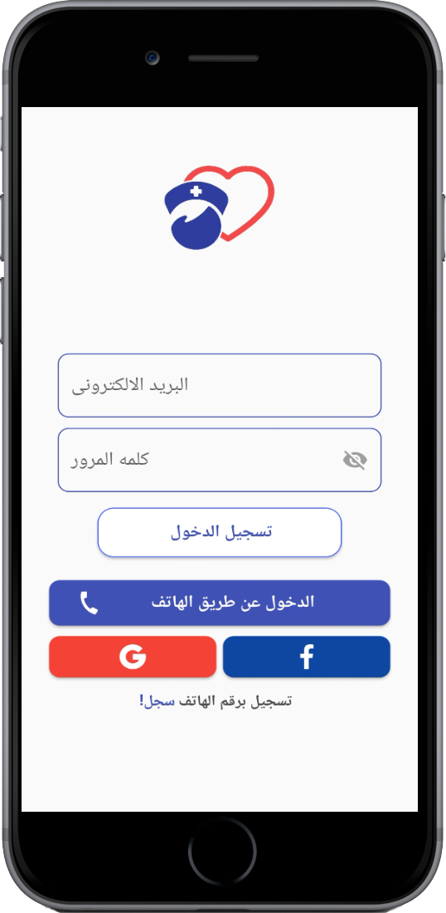

# Es3fni (Flutter Application)

It's a medical application that allows the user to request help, for example, requesting a nurse to give him an injection, taking a blood sample, or requesting physiotherapy sessions and more.

### Technologies:
* providers as state management.
* firebase as backend.
* google map.

## Why Es3fni?!

* The idea behind this is to provide job opportunities for nurses, help the elderly and children and meet their needs.
* 
### For using apps:
 [download android apks](https://drive.google.com/drive/folders/1qKFybKgjddpFpk3nOj3xl2s6H-WmRytC?usp=sharing)
 
## Features for users

* Allow user to make a requests for help with the ability to:
  * edit personal data for each request, so can make requst help for any person.
  * chooses between avilable services and view price for every one.
  * use coupons for discount.
  * choose specialization and gender for Nurse.
  * request supplies from the pharmacy.
  * schedule the service using interval date , days and times.
* Allow user to view request with ability to:
  * view status of request, if requst accepted by nurse, user can view nurse profile and rating him or request still pending.
  * view all request info.
  * edit requst or delete it before any nurse accept this service.
* Allow user to view archieved requests.
* Allow user to edit profile data and use points to payment for services
* Ability to change the language.

## Features for nurses

* Allow nurses to view all requests by location, distance, and specialty.
* Allow nurses to view patients' requests with the ability to:
  * View all order details.
  * View the patient's file and the distance between them.
  * The order is accepted and can be canceled after 5 minutes.
  * Finish the order by scanning the QR code or typing the verification code.
* View profile with the ability to:
  * Update profile data.
  * See all points collected.
* View archived requests.
* View all supplies.

## Features for admin panel
[admin panel repository](https://github.com/ayman-elslamony/Es3fniForadmin)
 

#### Code Quality

* Write readable and reusable code.
* Use single responsibility for functions.
* Reduce unnecessary requests for the Firebase.
* Easy to modify user interface.

## Screenshots for user

&nbsp;

&nbsp;

&nbsp;

&nbsp;

&nbsp;

&nbsp;

&nbsp;

## Screenshots for nurse

&nbsp;

&nbsp;

&nbsp;

&nbsp;

&nbsp;

#### Dependencies:

- localize_and_translate
- provider
- barcode_scan
- qr_flutter
- animated_text_kit
- firebase_core
- cloud_firestore
- firebase_storage
- google_maps_flutter
- geocoding
- firebase_auth
- google_sign_in
- flutter_facebook_login
- shared_preferences
- flutter_launcher_icons
- curved_navigation_bar
- toast
- shimmer
- photo_view
  
# What's Next?
 - [ ] Add notifications.
 - [ ] Update to null safety.
 - [ ] Add new features.
